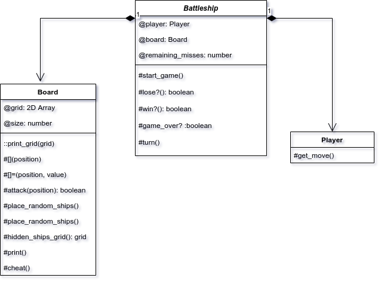

## Battleship Game

Here I built a command line version of the classic board game. This isn't a two-player version, though. Instead, you play against the computer. When starting, you can choose how large you want the grid to be. The computer will then randomly fill a quarter of the grid (floor value) with ships and hide them. You get to attack any position on the grid and find out if you sank a ship or didn't. The game ends when you sink all ships or run out of allocated misses.

This game utilizes a system of 3 classes: [Battleship](./lib/battleship.rb), [Board](./lib/board.rb), and [Player](./lib/player.rb). A majority of the functionality lies in Board, while Battleship is responsible for spawning Board and Player instances and keeping score. The script [player_battleship.rb](./lib/play_battleship.rb) is in charge of running the game.

To play the game, clone, `cd` into the game folder, and `ruby lib/play_battleship.rb`.

Below is the class diagram. Visit the individual classes to see how the methods are implemented. the [spec](./spec) file contains tests as well as documentation for the game in true RSpec spirit.

